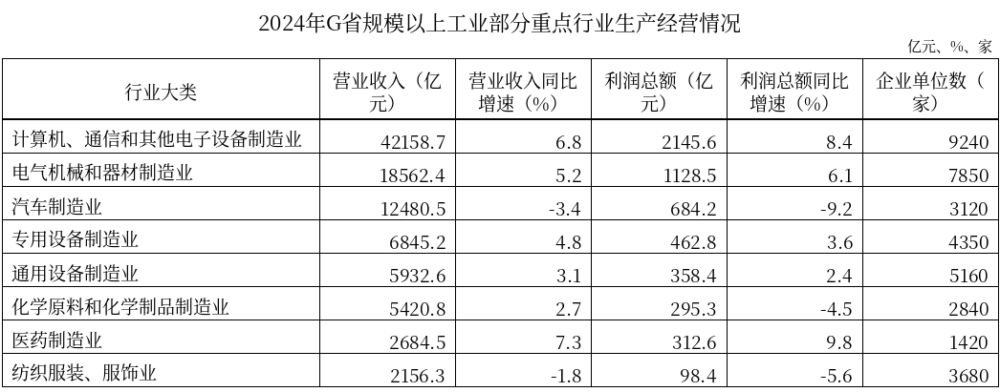
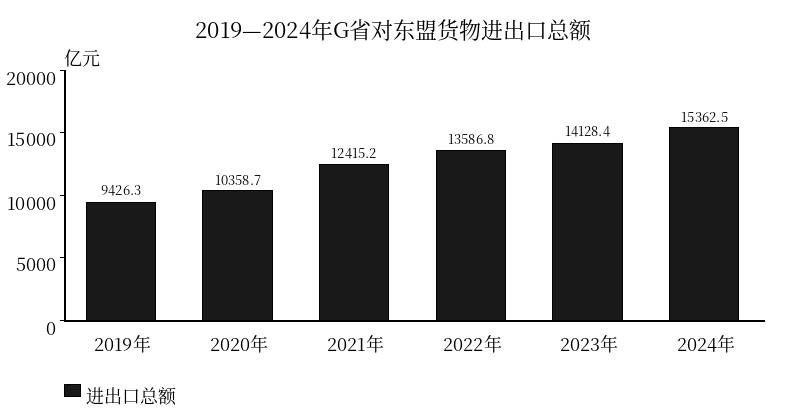
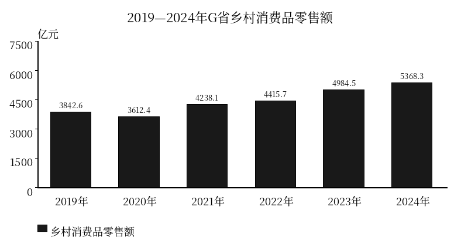

# 粤考日练：Hermes + Gemini 子 Agent 整套样本

4 篇、20 题；原创模拟材料。未入库、未部署。

以下从最终通过闸门的文件原样导出。仅将解析中的字面换行转换为 Markdown 换行，不改题干、选项、答案或数据。

## M01

2024年，G省财政运行总体平稳，收支结构持续优化。全省地方一般公共预算收入完成13862.4亿元，同比增长4.2%。分构成看，税收收入完成10285.6亿元，同比增长3.1%，占地方一般公共预算收入的比重为74.2%；非税收入完成3576.8亿元，同比增长7.5%。同期，全省政府性基金预算收入完成年度预算目标的102.8%；全省国有资本经营预算收入实现平稳增长。统计口径上，G省地方一般公共预算收入由税收收入和非税收入构成，不包含政府性基金预算收入、国有资本经营预算收入及社会保险基金预算收入。

2024年，G省加力提效实施积极财政政策，全省地方一般公共预算支出完成18542.7亿元，同比增长3.8%。全省财政资金持续向基层倾斜、向民生聚焦，全省民生类重点支出达到12986.5亿元，占一般公共预算支出的比重保持在七成。与此同时，重大战略与民生工程资金保障有力，自2022年启动实施的“民生水利与乡村振兴三年攻坚行动”截至2024年底累计完成投资5480.6亿元，顺利完成三年行动规划总投资目标。

分重点民生领域看，2024年G省民生类重点支出全部分解投向五大领域：一是教育支出，完成3824.4亿元，重点保障基础教育扩优提质和高等教育内涵式发展；二是社会保障和就业支出，完成2715.3亿元，同比增长6.4%，主要用于落实稳岗扩就业政策和兜底困难群众基本生活；三是卫生健康支出，完成2162.1亿元，同比增长9.1%，持续支持公共卫生体系建设和基层医疗服务能力提升；四是农林水支出，完成1845.0亿元，全面保障粮食安全与现代农业产业园建设；五是住房保障与节能环保支出，完成2439.6亿元，有力支撑保障性租赁住房建设与绿美生态建设工程。

注：
1. 本材料涉及金额及增速均为现价名义口径。
2. 民生类重点支出五大分项之和与总计略有差异，系四舍五入原因所致。

### M01-Q1

根据资料，下列各项财政资金中，纳入G省地方一般公共预算收入统计范围的是：

- A. 城镇职工基本养老保险基金收入
- B. 地方企业缴纳的增值税与企业所得税
- C. 国有独资企业上缴的国有资本经营利润
- D. 国有土地使用权出让收入

答案：B；审核难度：2

根据材料第一段，“统计口径上，G省地方一般公共预算收入由税收收入和非税收入构成，不包含政府性基金预算收入、国有资本经营预算收入及社会保险基金预算收入”。

A项属于社会保险基金预算收入，不属于地方一般公共预算收入；

D项属于政府性基金预算收入，不属于地方一般公共预算收入；

C项属于国有资本经营预算收入，不属于地方一般公共预算收入；

B项增值税与企业所得税属于税收收入，纳入地方一般公共预算收入统计范围。

故本题选B。

### M01-Q2

根据资料，下列统计指标中，材料未直接给出2024年当年具体金额的是：

- A. G省地方一般公共预算支出
- B. G省非税收入
- C. G省卫生健康支出
- D. G省政府性基金预算收入

答案：D；审核难度：1

根据材料定位各选项：

A项，由第二段“全省地方一般公共预算支出完成18542.7亿元”可知，直接给出了2024年当年具体金额；

B项，由第一段“非税收入完成3576.8亿元”可知，直接给出了2024年当年具体金额；

D项，由第一段“全省政府性基金预算收入完成年度预算目标的102.8%”可知，材料仅给出了预算完成率，未直接给出2024年当年的具体金额，也无法从其他数据推算；

C项，由第三段“卫生健康支出，完成2162.1亿元”可知，直接给出了2024年当年具体金额。

故本题选D。

### M01-Q3

2024年，G省教育支出占民生类重点支出的比重约为：

- A. 20.6%
- B. 25.2%
- C. 29.5%
- D. 34.6%

答案：C；审核难度：2

根据材料，2024年G省教育支出完成3824.4亿元，民生类重点支出达到12986.5亿元。所求比重为 3824.4 / 12986.5 ≈ 3824.4 / 13000 ≈ 29.4%，精确计算为 3824.4 / 12986.5 ≈ 29.45%，最接近C项。

A项对应误将分母取为地方一般公共预算支出（3824.4 / 18542.7 ≈ 20.6%）。

故本题选C。

### M01-Q4

2024年，G省非税收入同比增加了约多少亿元？

- A. 215
- B. 250
- C. 268
- D. 290

答案：B；审核难度：3

根据材料第一段，“非税收入完成3576.8亿元，同比增长7.5%”。

增长量计算公式为 增长量 = 现期量 × r / (1 + r)。代入数据：

3576.8 × 0.075 / (1 + 0.075) = 3576.8 × 0.075 / 1.075 ≈ 249.5 亿元，与B项最接近。

干扰项说明：

C项为误用现期量直接乘增速（3576.8 × 0.075 ≈ 268.3 亿元）；

D项为误将增长量按除以(1 - r)计算（3576.8 × 0.075 / 0.925 ≈ 290.0 亿元）。

故本题选B。

### M01-Q5

根据资料，以下说法可以判断属实的是：

- A. 2024年G省税收收入的同比增加量大于非税收入的同比增加量
- B. 2024年G省“民生水利与乡村振兴三年攻坚行动”完成投资超过5000亿元
- C. 2024年G省政府性基金预算收入超过4000亿元
- D. 2023年G省地方一般公共预算收入超过13500亿元

答案：A；审核难度：4

根据资料逐项分析：

D项，时间偷换与基期计算。由第一段“2024年全省地方一般公共预算收入完成13862.4亿元，同比增长4.2%”，2023年收入为 13862.4 / (1 + 0.042) ≈ 13303.6 亿元 < 13500 亿元，不属实；

B项，跨年累计与当年混淆。由第二段“自2022年启动实施的‘民生水利与乡村振兴三年攻坚行动’截至2024年底累计完成投资5480.6亿元”，5480.6亿元为三年累计投资额，不能推出2024年当年完成投资超过5000亿元，不属实；

C项，缺数无法比较。由第一段“全省政府性基金预算收入完成年度预算目标的102.8%”，资料未给出预算目标金额和实际收入金额，无法判断其实际金额是否超过4000亿元，不属实；

A项，增量比较。由第一段可知，2024年税收收入为10285.6亿元，同比增长3.1%，增量为 10285.6 × 0.031 / (1 + 0.031) ≈ 309.3 亿元；非税收入为3576.8亿元，同比增长7.5%，增量为 3576.8 × 0.075 / (1 + 0.075) ≈ 249.5 亿元。309.3 > 249.5 亿元，税收收入同比增加量大于非税收入，属实。

故本题选A。

## M02

2024年，G省规模以上工业经济运行稳中向好。全年规模以上工业（统计范围为年主营业务收入2000万元及以上的工业法人单位）实现营业收入166543.9亿元，同比增长4.2%，增速较上年提高0.7个百分点；实现利润总额9856.4亿元，同比增长5.8%。分门类看，采矿业实现营业收入1842.4亿元，同比下降2.6%；制造业实现营业收入154215.3亿元，同比增长4.1%；电力、热力、燃气及水生产和供应业实现营业收入10486.3亿元，同比增长6.5%。

2024年，全省规模以上工业企业研发投入持续加大，有研发活动的规上工业企业占比达到38.6%，高技术制造业投资同比增长11.2%。节能降碳扎实推进，重点耗能行业规上工业综合能耗完成“十四五”节能目标的86.5%。年末全省拥有规模以上工业企业68420家。

注：
1. 规模以上工业统计范围为年主营业务收入2000万元及以上的工业法人单位。所有金额及其增速均为现价名义口径。
2. 部分数据因四舍五入分项之和与总计略有差异。

### M02-Q1

2024年，G省规模以上工业中，计算机、通信和其他电子设备制造业与电气机械和器材制造业营业收入合计占全省规模以上工业营业收入的比重约为：

- A. 25.3%
- B. 36.5%
- C. 32.8%
- D. 39.4%

答案：B；审核难度：2

由图表可知，2024年G省计算机、通信和其他电子设备制造业营业收入为42158.7亿元，电气机械和器材制造业营业收入为18562.4亿元；由正文可知，全省规模以上工业实现营业收入166543.9亿元。
两者营业收入合计为 42158.7 + 18562.4 = 60721.1 亿元。
占全省规模以上工业营业收入的比重为 60721.1 / 166543.9 ≈ 36.46% ≈ 36.5%。
错误路径分析：
A项：42158.7 / 166543.9 ≈ 25.3%，遗漏电气机械和器材制造业，只算了计算机行业占比；
C项：误将电气机械看成汽车制造业（12480.5亿元），(42158.7 + 12480.5) / 166543.9 = 54639.2 / 166543.9 ≈ 32.8%；
D项：60721.1 / 154215.3 ≈ 39.4%，误以制造业营业收入总额作为分母。

### M02-Q2

2024年，G省规模以上工业营业收入比2022年增长了约：

- A. 4.9%
- B. 7.7%
- C. 9.3%
- D. 7.8%

答案：D；审核难度：3

根据正文第一段，“2024年，全年规模以上工业实现营业收入166543.9亿元，同比增长4.2%，增速较上年提高0.7个百分点”。
可得2024年增速 r1 = 4.2%，2023年增速 r2 = 4.2% - 0.7% = 3.5%。
根据两期间隔增长率公式 R = r1 + r2 + r1 × r2，代入数据得：
R = 4.2% + 3.5% + 4.2% × 3.5% = 7.7% + 0.147% = 7.847% ≈ 7.8%。
错误路径分析：
A项：将2023年增速误算为提高后的 4.2% + 0.7% = 4.9%；
B项：直接将两期增速相加 4.2% + 3.5% = 7.7%，遗漏交叉相乘项；
C项：误将2023年增速算为4.9%并代入间隔增长率公式计算（4.2% + 4.9% + 4.2% × 4.9% ≈ 9.3%）。

### M02-Q3

2023年，G省规模以上电气机械和器材制造业实现的营业收入约为多少亿元？

- A. 17597亿元
- B. 19581亿元
- C. 19528亿元
- D. 17645亿元

答案：D；审核难度：3

根据表格第二行数据，2024年G省规模以上电气机械和器材制造业营业收入为18562.4亿元，同比增速为5.2%。
根据基期量公式 基期量 = 现期量 / (1 + 增长率)，可得：
2023年营业收入 = 18562.4 / (1 + 5.2%) = 18562.4 / 1.052 ≈ 17644.87 亿元，最接近17645亿元。
错误路径分析：
A项：18562.4 × (1 - 0.052) ≈ 17597亿元，误用“现期量×(1-r)”计算；
C项：18562.4 × (1 + 0.052) ≈ 19528亿元，基期现期倒置；
B项：18562.4 / (1 - 0.052) ≈ 19581亿元，符号搞反。

### M02-Q4

在专用设备制造业、通用设备制造业、化学原料和化学制品制造业、医药制造业4个行业中，2024年平均每家企业营业收入最高的行业是：

- A. 专用设备制造业
- B. 通用设备制造业
- C. 化学原料和化学制品制造业
- D. 医药制造业

答案：C；审核难度：3

根据公式：平均每家企业营业收入 = 营业收入 / 企业单位数。分别计算题干给出的4个行业：
专用设备制造业：6845.2亿元 / 4350家 = 68452000万元 / 4350家 ≈ 15736.1 万元/家；
通用设备制造业：5932.6亿元 / 5160家 = 59326000万元 / 5160家 ≈ 11497.3 万元/家；
化学原料和化学制品制造业：5420.8亿元 / 2840家 = 54208000万元 / 2840家 ≈ 19087.3 万元/家；
医药制造业：2684.5亿元 / 1420家 = 26845000万元 / 1420家 ≈ 18904.9 万元/家。
比较可知，19087.3 > 18904.9 > 15736.1 > 11497.3 万元/家，最高的是化学原料和化学制品制造业。

### M02-Q5

不能从上述资料中推出的是：

- A. 2024年，计算机、通信和其他电子设备制造业营业收入同比增速比其利润总额同比增速低1.6个百分点
- B. 2024年，计算机、通信和其他电子设备制造业实现的利润总额占全省规模以上工业利润总额的比重超过20%
- C. 2024年，G省年主营业务收入在2000万元以下的规模以下工业企业实现营业收入超过10000亿元
- D. 2024年，汽车制造业平均每家企业实现的营业收入高于专用设备制造业

答案：C；审核难度：4

A项，根据表格，2024年计算机、通信和其他电子设备制造业营业收入同比增速为6.8%，利润总额同比增速为8.4%，营业收入增速比利润总额增速低 8.4% - 6.8% = 1.6个百分点，表述正确，能够推出；
B项，根据正文和表格，2024年计算机、通信和其他电子设备制造业利润总额为2145.6亿元，全省规上工业利润总额为9856.4亿元，比重为 2145.6 / 9856.4 ≈ 21.77% > 20%，表述正确，能够推出；
D项，根据表格，汽车制造业平均每家企业营收为 12480.5亿元 / 3120家 ≈ 4.00亿元/家，专用设备制造业平均每家企业营收为 6845.2亿元 / 4350家 ≈ 1.57亿元/家，汽车制造业明显更高，表述正确，能够推出；
C项，根据正文第一段及注1，本资料统计范围明确为“年主营业务收入2000万元及以上的工业法人单位”（即规模以上工业），全篇材料未包含任何年主营业务收入在2000万元以下的规模以下工业企业数据，因此无法推出规下工业企业的营业收入情况。不能推出。

## M03

2024年，G省货物进出口统计范围内有进出口经营权且海关有监管记录的企业实现外贸进出口总额86452.8亿元，同比增长5.2%（名义口径，下同）。其中，出口额54823.1亿元，增长6.1%；进口额31629.7亿元，增长3.6%。全年实现贸易顺差23193.4亿元。

按企业性质分，2024年G省民营企业出口额34562.5亿元，同比增长8.5%；外商投资企业出口额16834.4亿元，同比增长1.8%；国有企业出口额3426.3亿元，同比增长4.2%。

主要贸易市场中，2024年G省对第一大贸易伙伴东盟货物进出口总额达15362.5亿元，同比增长8.7%；对欧盟货物进出口总额9842.1亿元，增长4.5%；对美国货物进出口总额9568.3亿元，增长2.1%。

新业态发展方面，2024年G省跨境电商进出口额达9320.6亿元，同比增长10.8%。自2021年实施外贸新业态培优三年行动以来，截至2024年底G省累计培育省级外贸综合服务示范企业186家；2024年重点外贸综合服务企业综合业务考核达标率为91.2%。

注：因四舍五入，分项之和与总计略有差异。

### M03-Q1

2024年G省对东盟货物进出口总额比2022年增加了约多少亿元？

- A. 1234.1亿元
- B. 1875.7亿元
- C. 1775.7亿元
- D. 2947.3亿元

答案：C；审核难度：2

根据柱状图，2024年G省对东盟货物进出口总额为15362.5亿元，2022年为13586.8亿元。
所求增量为：15362.5 - 13586.8 = 1775.7亿元。
【干扰项分析】
A项（1234.1亿元）：误看年份为比2023年增加（15362.5 - 14128.4 = 1234.1亿元）；
B项（1875.7亿元）：退位减法计算失误；
D项（2947.3亿元）：误看年份为比2021年增加（15362.5 - 12415.2 = 2947.3亿元）。

### M03-Q2

2024年G省对东盟货物进出口总额比上年同期增加约多少亿元？

- A. 541.6亿元
- B. 1234.1亿元
- C. 1336.5亿元
- D. 2056.5亿元

答案：B；审核难度：2

根据柱状图，2024年G省对东盟货物进出口总额为15362.5亿元，2023年为14128.4亿元。
同比增量为：15362.5 - 14128.4 = 1234.1亿元。
【干扰项分析】
A项（541.6亿元）：误取2023年的增量（14128.4 - 13586.8 = 541.6亿元）；
C项（1336.5亿元）：根据正文增速8.7%，误用本期量直接乘以增速计算增长量（A×r = 15362.5 × 8.7% ≈ 1336.5亿元）；
D项（2056.5亿元）：误取图表增量最大年份2021年的增量（12415.2 - 10358.7 = 2056.5亿元）。

### M03-Q3

2024年G省民营企业出口额占全省外贸出口总额的比重比上年同期：

- A. 上升约1.4个百分点
- B. 下降约2.4个百分点
- C. 下降约1.4个百分点
- D. 上升约2.4个百分点

答案：A；审核难度：3

根据资料第二段，2024年G省民营企业出口额为34562.5亿元，同比增速 a = 8.5%；根据资料第一段，全省外贸出口总额为54823.1亿元，同比增速 b = 6.1%。
两期比重差解题步骤：
① 比重趋势判断：部分增速 a (8.5%) > 整体增速 b (6.1%)，比重上升，排除C、B两项；
② 比重差范围判定：两期比重变化绝对值必定小于 |a - b| = 8.5% - 6.1% = 2.4个百分点，排除D项（D项为直接用两增速相减的干扰项）；
③ 精确计算公式：(A/B) × (a - b) / (1 + a) = (34562.5 / 54823.1) × (8.5% - 6.1%) / (1 + 8.5%) ≈ 63.04% × 2.4% / 1.085 ≈ 1.39个百分点，即上升约1.4个百分点。

### M03-Q4

2020—2024年间，G省对东盟货物进出口总额同比增量超过1000亿元的年份有几个？

- A. 1个
- B. 2个
- C. 4个
- D. 3个

答案：D；审核难度：3

根据柱状图，枚举2020—2024年间全部5个年份的同比增量如下：
- 2020年：10358.7 - 9426.3 = 932.4亿元，不超过1000亿元；
- 2021年：12415.2 - 10358.7 = 2056.5亿元，超过1000亿元；
- 2022年：13586.8 - 12415.2 = 1171.6亿元，超过1000亿元；
- 2023年：14128.4 - 13586.8 = 541.6亿元，不超过1000亿元；
- 2024年：15362.5 - 14128.4 = 1234.1亿元，超过1000亿元。
因此，同比增量超过1000亿元的年份共有2021年、2022年、2024年，共3个年份。

### M03-Q5

根据资料，下列说法正确的有：
①2024年G省内所有从事进出口贸易的企业实现进出口总额达86452.8亿元
②2024年G省培育省级外贸综合服务示范企业186家
③2024年G省对东盟货物进出口总额同比增速比对欧盟高4.2%
④2019—2024年，G省对东盟货物进出口总额逐年递增且各年均高于9000亿元

- A. 1个
- B. 2个
- C. 3个
- D. 4个

答案：A；审核难度：4

逐项核对分析如下：
①错误（考查统计范围）：资料第一段明确说明进出口统计范围为“货物进出口统计范围内有进出口经营权且海关有监管记录的企业”，无监管记录的企业不计入，陈述扩大为“省内所有从事进出口贸易的企业”，违背了统计范围边界；
②错误（考查跨年累计与当年）：资料第四段明确指出“自2021年实施外贸新业态培优三年行动以来，截至2024年底G省累计培育省级外贸综合服务示范企业186家”，186家为跨年累计培育总数，而非2024年当年数，混淆了累计与当年；
③错误（考查百分比与百分点辨析）：资料第三段显示，2024年G省对东盟货物进出口总额同比增速为8.7%，对欧盟为4.5%，二者增速差为 8.7% - 4.5% = 4.2个百分点，陈述误用“高4.2%”表述两个百分数的差额，混淆了百分比与百分点；
④正确（考查时间序列读图）：根据柱状图，2019—2024年G省对东盟货物进出口总额分别为9426.3亿元、10358.7亿元、12415.2亿元、13586.8亿元、14128.4亿元、15362.5亿元，逐年增加且各年数值均明显大于9000亿元，说法完全属实。
综上所述，正确的说法只有④1个。

## M04

2024年，G省统计范围涵盖辖区内从事消费品零售活动及餐饮服务的各类法人单位、产业活动单位和个体经营户，全省实现社会消费品零售总额47954.6亿元。按经营单位所在地分，城镇消费品零售额42586.4亿元，同比增长5.2%；乡村消费品零售额5368.3亿元，同比增长7.7%。按消费类型分，商品零售额42431.8亿元，同比增长5.1%；餐饮收入5522.8亿元，同比增长8.3%。

2024年，全省限额以上单位消费品零售额17245.3亿元，同比增长4.6%。其中，通过公共网络实现的商品零售额3658.2亿元，同比增长11.4%，占全省限额以上单位消费品零售额的比重为21.2%，比上年提高1.3个百分点。在限额以上单位主要商品零售中，粮油食品类零售额2143.6亿元，同比增长6.8%；服装鞋帽针纺织品类零售额1285.4亿元，同比增长2.3%；新能源汽车零售额1834.7亿元，同比增长28.6%。

2024年，全省快递业务量达412.3亿件，同比增长16.8%；实现快递业务收入3241.6亿元，同比增长13.2%。自2021年全省“乡村商业体系建设行动”启动以来至2024年底，全省累计建成县域商业建设行动重点项目1286个，建设进度提前完成规划期总目标任务的107.2%。

注：
1. 统计范围：涵盖G省辖区内有消费品零售业务活动以及提供餐饮服务的法人单位、产业活动单位和个体经营户；不包括企业（单位）之间用于生产经营和业务开支的消费。
2. 金额及增速口径：文中所有涉及零售额的绝对金额及增长速度均按现价计算。
3. 因四舍五入，按经营单位所在地分项之和与总计略有差异。

### M04-Q1

2019—2024年间，G省乡村消费品零售额首次超过4500亿元的年份是：

- A. 2021年
- B. 2023年
- C. 2022年
- D. 2024年

答案：B；审核难度：1

由图表可知，2019—2024年G省乡村消费品零售额分别为：2019年3842.6亿元，2020年3612.4亿元，2021年4238.1亿元，2022年4415.7亿元，2023年4984.5亿元，2024年5368.3亿元。其中首次超过4500亿元的年份为2023年（4984.5亿元）。

### M04-Q2

根据上述资料，下列统计指标中未给出2024年具体数值的是：

- A. 全省限额以上单位新能源汽车零售额
- B. 全省快递业务收入
- C. 全省限额以上单位粮油食品类零售额
- D. 乡村商业体系建设行动重点项目的年度投资金额

答案：D；审核难度：1

A项，由正文第二段可知，2024年限额以上单位新能源汽车零售额为1834.7亿元，已给出；B项，由正文第三段可知，2024年实现快递业务收入为3241.6亿元，已给出；C项，由正文第二段可知，2024年限额以上单位粮油食品类零售额为2143.6亿元，已给出；D项，由正文第三段可知，材料仅提及自2021年启动以来至2024年底“累计建成县域商业建设行动重点项目1286个，建设进度提前完成规划期总目标任务的107.2%”，未提及2024年重点项目的年度投资金额，符合题意。

### M04-Q3

2024年，G省乡村消费品零售额占社会消费品零售总额的比重约为：

- A. 8.9%
- B. 12.7%
- C. 11.2%
- D. 15.5%

答案：C；审核难度：2

由正文第一段可知，2024年G省社会消费品零售总额为47954.6亿元，乡村消费品零售额为5368.3亿元。则所求比重为 5368.3 / 47954.6 ≈ 5368.3 ÷ 47954.6 ≈ 11.2%。A项为数字取错干扰项；B项为误用商品零售额（42431.8亿元）作为分母的计算结果（5368.3 / 42431.8 ≈ 12.7%）；D项为计算偏差干扰项。

### M04-Q4

2024年，G省社会消费品零售总额同比增长率约为：

- A. 5.5%
- B. 4.6%
- C. 6.5%
- D. 7.7%

答案：A；审核难度：3

方法一（定性定界）：由正文第一段可知，全省社会消费品零售总额由城镇消费品零售额（42586.4亿元，同比增长5.2%）和乡村消费品零售额（5368.3亿元，同比增长7.7%）两部分组成。根据混合增长率性质，整体增长率必介于城镇与乡村增速之间，即 5.2% < 整体增长率 < 7.7%，排除B项（4.6%）和D项（7.7%）；因城镇零售额规模（42586.4亿元）远大于乡村零售额（5368.3亿元），混合增速严重偏向城镇增速（5.2%），必小于两者的算术平均值 (5.2% + 7.7%) / 2 = 6.45%，排除C项（6.5%），故选A项（5.5%）。
方法二（定量计算）：2023年城镇零售额基期为 42586.4 / (1 + 5.2%) ≈ 40481.4亿元，乡村零售额基期为 5368.3 / (1 + 7.7%) ≈ 4984.5亿元；2024年总增量为 (42586.4 - 40481.4) + (5368.3 - 4984.5) = 2105.0 + 383.8 = 2488.8亿元；基期总额为 40481.4 + 4984.5 = 45465.9亿元；整体增长率为 2488.8 / 45465.9 ≈ 5.47% ≈ 5.5%。

### M04-Q5

能够从上述资料中推出的是：

- A. 2024年，G省城镇消费品零售额同比增量超过2000亿元
- B. 2024年当年，G省建设乡村商业体系建设行动重点项目超过1000个
- C. 2024年，G省限额以上单位通过公共网络实现的商品零售额占限额以上单位消费品零售额的比重比上年提高1.3%
- D. 2019—2024年间，G省乡村消费品零售额每年均同比增加

答案：A；审核难度：4

D项：时间/趋势判断。读图可知，2020年乡村消费品零售额为3612.4亿元，低于2019年的3842.6亿元，为同比负增长（减少230.2亿元），并非每年均同比增加，错误；
B项：跨年累计与当年判断。正文第三段明确指出“自2021年全省乡村商业体系建设行动启动以来至2024年底，全省累计建成县域商业建设行动重点项目1286个”，这是4年跨年累计总量，资料未给出2024年单年建成的重点项目数，不能推出单年超过1000个，错误；
C项：百分点与百分比辨析（required_trap: percent_vs_point）。正文第二段指出“占全省限额以上单位消费品零售额的比重为21.2%，比上年提高1.3个百分点”，比重属于百分数，两期比重的变动应用“百分点”表示，选项误用为百分比“1.3%”，错误；
A项：增量计算判断。正文第一段指出“城镇消费品零售额42586.4亿元，同比增长5.2%”。同比增长量为 42586.4 × 5.2% / (1 + 5.2%) = 42586.4 × 0.052 / 1.052 ≈ 2105.0亿元 > 2000亿元，能够推出，正确。

