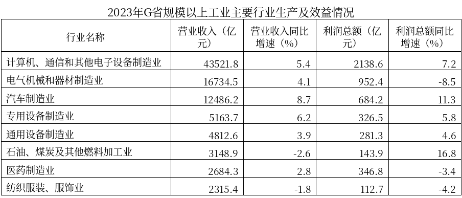
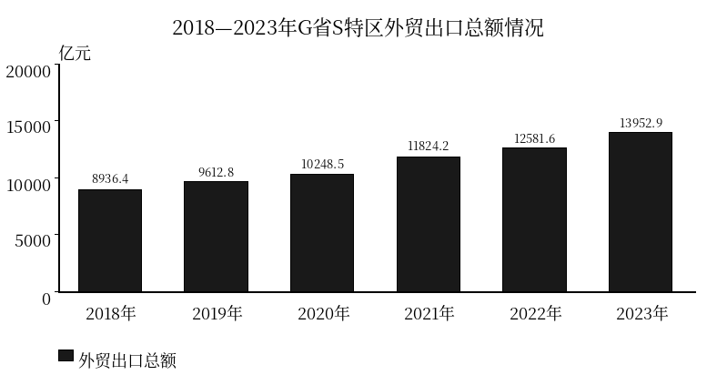
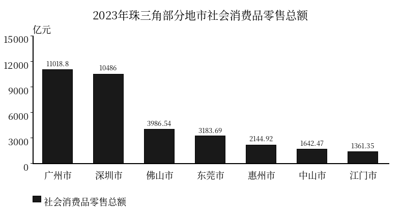

# 粤考资料分析日练·改进版验收样本

批次：20260927_hermes_ziliao_15c7e407
题组：粤考日练-资料分析-mid-20260927-改进版
模型：gemini-3.8-flash-high

4篇材料、20题。Gemini生成，独立盲解、设计审核、视觉闸门及人工核查通过，已入库并验证线上内容。材料为原创模拟数据，不作为官方统计引用。

## M01

2023年，G省财政运行总体平稳、好于预期。全省一般公共预算收入完成13920.6亿元，同比增长4.3%。其中，税收收入完成10486.2亿元，同比增长5.8%；非税收入完成3434.4亿元，同比基本持平。2023年全省落实支持中小微企业及科技创新等税费政策，当年新增减税降费及退税缓费超1680亿元。此外，中央对G省转移支付收入全年预算执行良好，完成率达到102.4%。

全省一般公共预算支出完成18536.8亿元，同比增长2.1%。G省持续优化支出结构，兜牢兜实基层“三保”底线。全省重点民生支出统计范围涵盖教育、社会保障和就业、卫生健康、节能环保以及农林水支出5个重点领域，其他如科学技术、交通运输等则列入一般公共事务与基础设施建设统筹保障，不计入本公报重点民生支出口径。2023年，全省重点民生支出合计达12975.8亿元，占全省一般公共预算支出的比重达70.0%。

分领域看，2023年全省重点民生支出中：教育支出3892.7亿元，同比增长3.2%；社会保障和就业支出3151.3亿元，同比增长4.6%；卫生健康支出2138.4亿元，同比下降1.5%；节能环保支出1683.2亿元，同比增长14.3%；农林水支出2110.2亿元，同比增长6.1%。

其他领域中，2023年全省科学技术支出完成1124.6亿元，交通运输支出完成842.1亿元。全年全省政府性基金预算支出完成5428.6亿元，预算完成率为96.8%。

注：文中涉及收支金额及增速均为现行价格计算的名义口径；部分分项数据因四舍五入与合计数略有差异。

### M01-Q1

根据资料，下列各项支出中，列入2023年G省“重点民生支出”统计口径的是：

- A. 交通运输支出
- B. 科学技术支出
- C. 节能环保支出
- D. 政府性基金预算支出

**答案：C** · 难度 1/5

定位资料第二段：“全省重点民生支出统计范围涵盖教育、社会保障和就业、卫生健康、节能环保以及农林水支出5个重点领域，其他如科学技术、交通运输等则列入一般公共事务与基础设施建设统筹保障，不计入本公报重点民生支出口径。”结合选项可知，节能环保支出属于重点民生支出统计口径，科学技术支出、交通运输支出和政府性基金预算支出均不在此口径内。因此，C项正确。

### M01-Q2

根据资料，下列各项指标中，无法直接获取或推算出2023年具体金额的是：

- A. 中央对G省转移支付实际收入
- B. 全省税收收入
- C. 全省节能环保支出
- D. 全省政府性基金预算支出

**答案：A** · 难度 1/5

定位资料第一段：“中央对G省转移支付收入全年预算执行良好，完成率达到102.4%。”材料仅给出了中央对G省转移支付收入的预算完成率，未给出预算金额或实际完成金额，因此无法得知其具体金额，A项符合题意。B项税收收入在第一段直接给出为10486.2亿元，C项节能环保支出在第三段直接给出为1683.2亿元，D项政府性基金预算支出在第四段直接给出为5428.6亿元，均可直接获取。

### M01-Q3

2023年，G省税收收入占全省一般公共预算收入的比重约为：

- A. 24.7%
- B. 75.3%
- C. 70.0%
- D. 56.6%

**答案：B** · 难度 2/5

定位资料第一段：“全省一般公共预算收入完成13920.6亿元……其中，税收收入完成10486.2亿元”。所求比重为 10486.2 / 13920.6 ≈ 1048.6 / 1392 ≈ 75.3%。A项24.7%为非税收入占比（3434.4 / 13920.6），D项56.6%为税收收入占一般公共预算支出的比重（10486.2 / 18536.8），C项70.0%为重点民生支出占一般公共预算支出的比重。故正确答案为B。

### M01-Q4

2023年，G省节能环保支出同比约增加了多少亿元？

- A. 210.6
- B. 1472.6
- C. 240.7
- D. 280.9

**答案：A** · 难度 3/5

定位资料第三段：“节能环保支出1683.2亿元，同比增长14.3%”。根据增长量计算公式，增长量 = A × r / (1 + r) = 1683.2 × 14.3% / (1 + 14.3%) ≈ 1683.2 × 0.143 / 1.143 ≈ 210.6亿元。若直接计算 A × r 则为 1683.2 × 14.3% ≈ 240.7亿元（对应C项干扰项）；若计算基期量 A / (1 + r) 则为 1472.6亿元（对应B项）。故正确答案为A。

### M01-Q5

根据资料，以下说法可以判断属实的是：

- A. 2023年G省税收收入同比增速比全省一般公共预算收入同比增速快1.5%
- B. 2023年G省重点民生支出中，科学技术支出的规模位列教育支出和社保就业支出之后
- C. 2023年中央对G省转移支付收入超过全省税收收入规模
- D. 2023年G省重点民生支出涵盖的5个领域中，同比出现负增长的领域仅有1个

**答案：D** · 难度 3/5

A项错误，考查百分比与百分点辨析。税收收入同比增速（5.8%）与一般公共预算收入同比增速（4.3%）相差 5.8% - 4.3% = 1.5个百分点，而非1.5%；B项错误，考查统计范围。资料第二段明确指出科学技术支出“不计入本公报重点民生支出口径”，不能混入重点民生支出内部排序；C项错误，考查缺数无法比较。资料仅提及中央对G省转移支付收入“完成率达到102.4%”，未提及具体金额，无法与税收收入进行规模比较；D项正确，第三段中重点民生支出的5个领域增速分别为：教育（+3.2%）、社保就业（+4.6%）、卫生健康（-1.5%）、节能环保（+14.3%）、农林水（+6.1%），仅有卫生健康支出同比下降，即负增长的领域仅有1个。故本题选D。

## M02

2023年，G省坚持稳中求进工作总基调，全力推进现代化产业体系建设，全省规模以上工业生产平稳恢复，效益状况逐步改善。本调查统计范围为G省规模以上工业法人单位，即年主营业务收入在2000万元及以上的工业企业法人，不含规模以下工业企业以及工业个体工商户。

2023年全年，G省规模以上工业实现营业收入182647.3亿元，同比增长3.6%。分季度看，一季度、二季度、三季度全省规上工业营业收入分别为41283.5亿元、44145.6亿元、46413.5亿元，前三季度累计实现营业收入131842.6亿元，同比增长3.1%。全年规模以上工业实现利润总额10283.4亿元，同比增长2.3%，增速较前三季度加快1.8个百分点。

产业升级与项目建设持续推进。2023年，全省重点工业项目年度投资完成率为108.7%，超额完成年初既定目标。自2020年制造业高质量发展专项行动实施以来至2023年底，全省累计设立数字化转型标杆企业428家，累计发放技术改造信贷资金超3000亿元。2023年末，全省规模以上工业企业资产总计达到189346.2亿元，比2020年末增加37205.4亿元；其中医药制造业规上企业从业人员平均人数为41.6万人。

### M02-Q1

2023年，G省规模以上工业中计算机、通信和其他电子设备制造业实现的利润总额占全省规模以上工业实现利润总额的比重约为：

- A. 11.7%
- B. 17.5%
- C. 23.8%
- D. 20.8%

**答案：D** · 难度 2/5

定位文字第二段及表格第一行：2023年全省规模以上工业实现利润总额为10283.4亿元；计算机、通信和其他电子设备制造业利润总额为2138.6亿元。所求比重为 2138.6 / 10283.4 ≈ 2139 / 10283 ≈ 20.8%。若误用该行业营业收入占全省比重计算，则为 43521.8 / 182647.3 ≈ 23.8%（对应C项）。

### M02-Q2

2023年，G省汽车制造业营业收入利润率（利润总额/营业收入）比上年同期约：

- A. 下降2.4%
- B. 增长2.6%
- C. 增长2.4%
- D. 下降2.6%

**答案：C** · 难度 3/5

定位表格第三行：2023年汽车制造业营业收入同比增速为8.7%（记为b），利润总额同比增速为11.3%（记为a）。营业收入利润率为“利润总额/营业收入”，其同比增速代入比值增长率公式为：r = (a - b) / (1 + b) = (11.3% - 8.7%) / (1 + 8.7%) = 2.6% / 1.087 ≈ 2.39% ≈ 2.4%。若直接相减得到 11.3% - 8.7% = 2.6%（对应B项），混淆了百分点与比值增长率计算。

### M02-Q3

2022年，G省规模以上工业中电气机械和器材制造业实现的营业收入约为多少亿元？

- A. 15380
- B. 16075
- C. 16048
- D. 17421

**答案：B** · 难度 3/5

定位表格第二行：2023年电气机械和器材制造业营业收入为16734.5亿元，同比增长4.1%。则2022年营业收入（基期量）为 16734.5 / (1 + 4.1%) = 16734.5 / 1.041 ≈ 16075.4亿元。若误用现期乘以(1+r)计算，得到 16734.5 * 1.041 ≈ 17421亿元（对应D项）；若误用 16734.5 * (1 - 0.041)，得到约16048亿元（对应C项）。

### M02-Q4

2020年末至2023年末，G省规模以上工业企业资产总计平均每年增加约多少万亿元？

- A. 0.93
- B. 1.49
- C. 1.24
- D. 1.86

**答案：C** · 难度 2/5

定位文字第三段：“2023年末，全省规模以上工业企业资产总计达到189346.2亿元，比2020年末增加37205.4亿元”。从2020年末至2023年末，经历2021年、2022年、2023年共3个增长年份，年份跨度 n = 2023 - 2020 = 3年。年均增长量 = 增长总量 / n = 37205.4 / 3 = 12401.8亿元 ≈ 1.24万亿元。若误将2020年、2021年、2022年、2023年共算为4年，则算得 37205.4 / 4 ≈ 0.93万亿元（对应A项）。

### M02-Q5

不能从上述资料中推出的是：

- A. 2023年第四季度，G省规模以上工业实现的营业收入高于前三季度中任意一个季度
- B. 2023年，G省包含规模以下企业在内的全部工业企业实现的营业收入超过18万亿元
- C. 2023年前三季度，G省规模以上工业实现利润总额同比增速为0.5%
- D. 2023年当年，G省发放技术改造信贷资金超过3000亿元

**答案：D** · 难度 4/5

逐项分析：
D项，定位文字第三段，“自2020年制造业高质量发展专项行动实施以来至2023年底……累计发放技术改造信贷资金超3000亿元”，该数据为2020—2023年4年间的跨年累计总额，不能推出2023年当年发放金额超过3000亿元，属于跨年累计偷换为当年，不能推出；
B项，定位文字第一、二段，本调查统计范围为规模以上工业企业法人，不含规模以下工业企业以及工业个体工商户，2023年全省规上工业营业收入为182647.3亿元（约18.26万亿元）。由于规模以下企业及个体工商户营业收入非负，包含规模以下企业在内的全部工业企业营业收入不小于规模以上工业营业收入，而规上本身已超过18万亿元，故全部工业企业营业收入必然超过18万亿元，能够推出；
C项，定位文字第二段，“全年规模以上工业实现利润总额10283.4亿元，同比增长2.3%，增速较前三季度加快1.8个百分点”，则2023年前三季度同比增速为 2.3% - 1.8% = 0.5%，能够推出；
A项，定位文字第二段，2023年一、二、三季度规上工业营业收入分别为41283.5亿元、44145.6亿元、46413.5亿元，前三季度累计131842.6亿元，全年为182647.3亿元。则第四季度营业收入为 182647.3 - 131842.6 = 50804.7亿元，高于一季度、二季度和三季度的营业收入，能够推出。

## M03

2023年，G省S特区外贸进出口承压回升、结构持续优化。全年外贸进出口总额实现24867.3亿元，同比增长8.3%。其中，外贸进口总额为10914.4亿元，同比增长5.1%；外贸出口总额实现平稳增长。从主要品类看，2023年该特区高新技术产品出口额为6836.9亿元，同比增长7.2%，占同期外贸出口总额的比重为49.0%，比上年回落1.7个百分点；高新技术产品出口增速比上年放缓2.1个百分点。同期，民营企业出口占特区出口总额的比重达到62.4%，展现出较强的外贸韧性。

重点平台与项目建设稳步推进。2023年，S特区跨境电商综合试验区外贸产业基础设施年度投资目标完成率达到106.8%。自2020年启动自贸片区重点外贸主体倍增工程以来，截至2023年底特区累计拨付各类贴息与产业扶持资金43.6亿元。本统计口径涵盖G省S特区注册并发生实际进出口业务的海关企业（不含单纯转口保税仓储未实际结关部分）。

注：所有指标金额均为现价名义口径。部分分项因四舍五入原因与总计略有差异。

### M03-Q1

2023年，G省S特区外贸实现贸易顺差（外贸出口总额减外贸进口总额）约为多少亿元？

- A. 3038.5
- B. 2389.5
- C. 1667.2
- D. 3725.1

**答案：A** · 难度 2/5

根据正文，“2023年……外贸进口总额为10914.4亿元”；根据图表，2023年G省S特区外贸出口总额为13952.9亿元。外贸顺差 = 外贸出口总额 - 外贸进口总额 = 13952.9 - 10914.4 = 3038.5亿元。因此选择A项。

### M03-Q2

2023年，G省S特区外贸进出口总额同比约增加了多少亿元？

- A. 1905.8
- B. 1758.3
- C. 2064.0
- D. 2296.2

**答案：A** · 难度 2/5

根据正文，“2023年……全年外贸进出口总额实现24867.3亿元，同比增长8.3%”。已知现期量A和增速r，增长量计算公式为 Δ = A * r / (1 + r)。由于 8.3% ≈ 1/12，增长量约为 24867.3 / (12 + 1) = 24867.3 / 13 ≈ 1912.9亿元；精确计算为 24867.3 * 0.083 / 1.083 ≈ 1905.8亿元。选项C为直接误用 A * r = 24867.3 * 8.3% ≈ 2064.0亿元的干扰项。因此选择A项。

### M03-Q3

2022年，G省S特区高新技术产品出口额占同期特区外贸出口总额的比重为：

- A. 46.9%
- B. 47.3%
- C. 50.7%
- D. 51.1%

**答案：C** · 难度 2/5

根据正文，“2023年该特区高新技术产品出口额……占同期外贸出口总额的比重为49.0%，比上年回落1.7个百分点”。因此，2022年（上年）的比重为 49.0% + 1.7% = 50.7%。选项B（47.3%）是将“回落”错误按减法计算的结果（49.0% - 1.7% = 47.3%）。因此选择C项。

### M03-Q4

2019—2023年间，G省S特区外贸出口总额同比增量最大的年份是：

- A. 2020年
- B. 2021年
- C. 2022年
- D. 2023年

**答案：B** · 难度 2/5

根据图表数据，枚举2019—2023年各年出口总额及同比增量（现期量 - 上年量）：
2019年：9612.8 - 8936.4 = 676.4亿元；
2020年：10248.5 - 9612.8 = 635.7亿元；
2021年：11824.2 - 10248.5 = 1575.7亿元；
2022年：12581.6 - 11824.2 = 757.4亿元；
2023年：13952.9 - 12581.6 = 1371.3亿元。
对比可知，增量最大的年份为2021年（1575.7亿元）。因此选择B项。

### M03-Q5

根据资料，下列说法正确的有几个？
①2023年G省S特区外贸出口总额同比增长超过10%
②2023年G省S特区高新技术产品出口额同比增速比上年放缓2.1%
③2023年G省S特区当年拨付各类贴息与产业扶持资金43.6亿元
④G省S特区外贸统计口径涵盖了该特区单纯转口保税仓储未实际结关部分

- A. 0
- B. 3
- C. 2
- D. 1

**答案：D** · 难度 4/5

逐项核验：
①正确。根据图表，2023年出口总额为13952.9亿元，2022年为12581.6亿元。增速为 (13952.9 - 12581.6) / 12581.6 = 1371.3 / 12581.6 ≈ 10.9% > 10%。
②错误，属于“百分比与百分点混淆”。正文明确指出“高新技术产品出口增速比上年放缓2.1个百分点”，增速的变动应用百分点表示，陈述误用为百分比“2.1%”。
③错误，属于“跨年累计与当年混淆”。正文表述为“自2020年启动自贸片区重点外贸主体倍增工程以来，截至2023年底特区累计拨付各类贴息与产业扶持资金43.6亿元”，这是跨年累计值，并非2023年当年拨付金额。
④错误，属于“统计范围偷换”。正文第二段末句明确标注“本统计口径涵盖……海关企业（不含单纯转口保税仓储未实际结关部分）”，陈述偷换为包含。
综上所述，正确的说法只有1个（①）。因此选择D项。

## M04

2023年，G省社会消费品零售总额为47492.56亿元，同比增长5.8%。按经营单位所在地分，城镇消费品零售额39502.32亿元，同比增长5.6%；乡村消费品零售额7990.24亿元，同比增长6.8%。本次统计范围涵盖G省辖区内全部从事商品零售和提供餐饮服务活动的法人企业、产业活动单位及个体经营户。

消费新业态展现较强韧性。2023年，全省限额以上单位通过公共网络实现商品零售额3584.21亿元，同比增长13.8%，增速比上年加快3.2个百分点。接触型聚集型消费持续回暖，限额以上住宿业、餐饮业营业额同比分别增长23.1%、26.5%，限额以上单位餐饮收入同比增长24.8%。自2021年开展特色商贸提质行动以来，截至2023年底全省累计发放惠民消费券12.74亿元；2023年全省重点消费设施升级工程年度目标任务完成率达108.4%。

珠三角九市持续发挥消费主引擎作用，2023年九市社会消费品零售总额合计占全省总量的比重保持在八成以上。

注：1. 资料中涉及的金额与增速均为现价名义口径；2. 因四舍五入，部分分项之和与总计略有差异。

### M04-Q1

2023年，图中所列珠三角地市中社会消费品零售总额超过3000亿元的城市有几个？

- A. 4
- B. 3
- C. 5
- D. 6

**答案：A** · 难度 1/5

根据图表数据，2023年珠三角部分地市社会消费品零售总额分别为：广州市（11018.81亿元）、深圳市（10486.01亿元）、佛山市（3986.54亿元）、东莞市（3183.69亿元）、惠州市（2144.92亿元）、中山市（1642.47亿元）、江门市（1361.35亿元）。其中超过3000亿元的城市有广州市、深圳市、佛山市、东莞市，共4个。故本题选A。

### M04-Q2

根据资料中的统计范围，下列主体在G省辖区内开展的业务活动中，明确纳入本次社会消费品零售总额统计的是：

- A. 某物流货运企业提供的跨城货物运输服务
- B. 某临街个体面馆向就餐顾客提供的餐饮服务
- C. 某会计师事务所承接的企业财务审计业务
- D. 某商业银行网点向居民收取的金融理财咨询费

**答案：B** · 难度 1/5

根据材料第一段末句，“本次统计范围涵盖G省辖区内全部从事商品零售和提供餐饮服务活动的法人企业、产业活动单位及个体经营户”。A项为交通运输与物流服务，C项为商务审计专业服务，D项为金融服务，三者均不属于商品零售或餐饮服务活动；B项中临街个体面馆向就餐顾客提供的餐饮服务，属于“从事提供餐饮服务活动的个体经营户”，明确纳入本次统计范围。故本题选B。

### M04-Q3

2023年，G省乡村消费品零售额占全省社会消费品零售总额的比重约为：

- A. 12.5%
- B. 20.2%
- C. 16.8%
- D. 83.2%

**答案：C** · 难度 2/5

根据材料第一段，2023年G省社会消费品零售总额为47492.56亿元，乡村消费品零售额为7990.24亿元。所求现期比重 = 7990.24 / 47492.56 ≈ 8000 / 47500 ≈ 16.84%，与C项最为接近。D项为城镇消费品零售额的比重（约83.2%）。故本题选C。

### M04-Q4

2022年，G省城镇消费品零售额约为乡村消费品零售额的：

- A. 3.5倍
- B. 4.2倍
- C. 5.8倍
- D. 5.0倍

**答案：D** · 难度 3/5

根据材料第一段，2023年G省社会消费品零售总额同比增长5.8%，其中城镇增长5.6%，乡村增长6.8%。社会消费品零售总额＝城镇＋乡村，应用十字交叉法求基期之比：城镇增速 5.6%，乡村增速 6.8%，混合增速 5.8%。十字交叉做差得：基期城镇量 / 基期乡村量 = (6.8% - 5.8%) / (5.8% - 5.6%) = 1.0% / 0.2% = 5。因此2022年城镇消费品零售额约为乡村的5.0倍。故本题选D。

### M04-Q5

能够从上述资料中推出的是：

- A. 2023年G省发放惠民消费券12.74亿元
- B. 2022年全省限额以上单位通过公共网络实现商品零售额同比增长10.6%
- C. 2023年全省限额以上单位通过公共网络实现商品零售额增速比上年加快3.2%
- D. 2023年G省限额以上住宿业营业额高于餐饮业营业额

**答案：B** · 难度 3/5

A项：材料明确为“自2021年开展特色商贸提质行动以来，截至2023年底全省累计发放惠民消费券12.74亿元”，系跨年累计金额，不能推出2023年当年发放额为12.74亿元，错误；D项：材料仅给出限额以上住宿业、餐饮业营业额的同比增长率分别为23.1%、26.5%，未给出两者的绝对值，属于缺数无法比较绝对量大小，错误；C项：材料表述为“增速比上年加快3.2个百分点”，选项将“百分点”偷换为“百分比（%）”，错误；B项：根据材料第二段，“2023年……同比增长13.8%，增速比上年加快3.2个百分点”，则2022年同比增速为 13.8% - 3.2% = 10.6%，正确。故本题选B。
