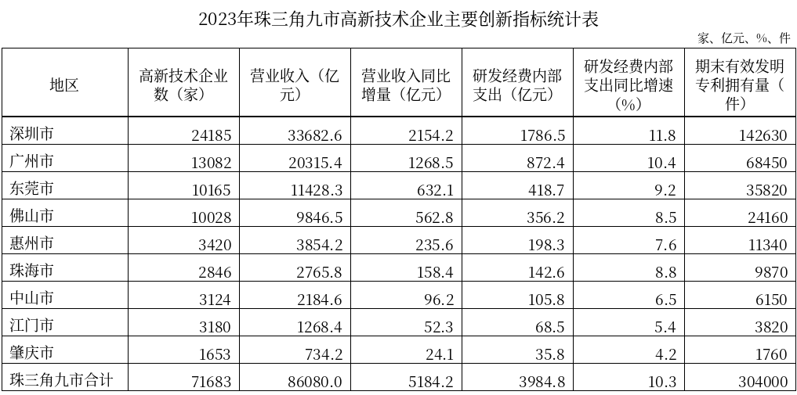
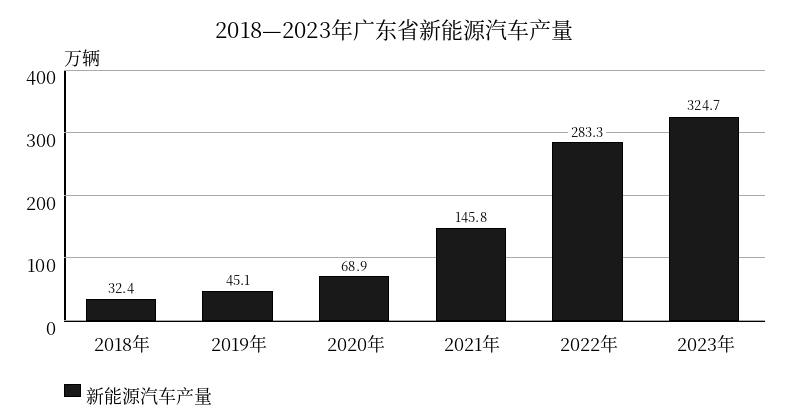
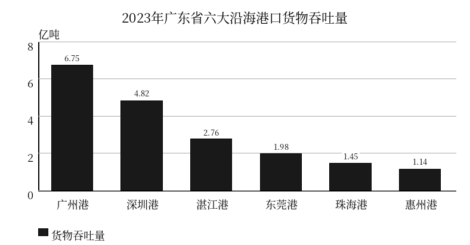

# 粤考日练·资料分析：Gemini 实跑验收样本

批次：20260927_hermes_ziliao_f91707eb；模型：gemini-3.8-flash-high。

4篇材料、20题，原创模拟。完整闸门与人工核查通过；未入库、未合并、未部署。

以下附答案和解析，适合验收阅读。材料为模拟数据，不作为官方统计引用。

## M01

2023年，G省深入推进新型储能产业高质量发展，全省新型储能产业实现营业产值1486.3亿元，展现出强劲的集聚发展势头。同期，全省发电设备及传统电力装备制造业实现产值382.6亿元。

从核心产业链环节看，2023年全省锂离子电池储能核心环节实现产值1056.8亿元；储能控制系统（含EMS、BMS及专用变流装置）实现产值178.4亿元；储能系统集成及其他配套关键环节实现产值251.1亿元。2023年，全省新型储能重点示范项目年度计划投资完成率达到108.5%。

电站应用与装机规模方面，2023年全省新增新型储能电站装机规模为40.7万千瓦。截至2023年底，全省已投产的新型储能电站累计装机规模达到162.8万千瓦，同比增长33.3%。全省新型储能电站年平均等效利用小时数为612小时。同期，全省抽水蓄能电站累计装机规模达到828.5万千瓦，抽水蓄能年发电利用小时数为1420小时。

注：
①新型储能是指除抽水蓄能以外，以输出电能为主要形式并对外提供电网调节服务的储能技术，统计口径涵盖电化学储能、压缩空气储能、飞轮储能等，本资料中新型储能相关统计数据均不包含抽水蓄能；
②文中所列产值、营业收入及投资金额口径均为现价名义数据。

### M01-Q1

根据资料，下列各项储能技术中，明确不包含在G省新型储能统计口径中的是：

- A. 压缩空气储能
- B. 飞轮储能
- C. 抽水蓄能
- D. 电化学储能

**答案：C** · 难度 1/5

定位资料注①：“新型储能是指除抽水蓄能以外，以输出电能为主要形式并对外提供电网调节服务的储能技术……本资料中新型储能相关统计数据均不包含抽水蓄能”。因此抽水蓄能明确不包含在新型储能统计口径中。

### M01-Q2

2023年G省下列指标中，资料未提及具体数值的是：

- A. 新型储能重点示范项目年度计划投资额
- B. 抽水蓄能年发电利用小时数
- C. 新增新型储能电站装机规模
- D. 新型储能电站年平均等效利用小时数

**答案：A** · 难度 1/5

定位资料各处数据：C项，第3段明确给出“新增新型储能电站装机规模为40.7万千瓦”；B项，第3段末明确给出“抽水蓄能年发电利用小时数为1420小时”；A项，第2段仅给出“新型储能重点示范项目年度计划投资完成率达到108.5%”，未给出计划投资额的具体数值；D项，第3段明确给出“全省新型储能电站年平均等效利用小时数为612小时”。因此资料未提及具体数值的是A项。

### M01-Q3

2023年，G省锂离子电池储能核心环节实现的产值占全省新型储能产业营业产值的比重约为：

- A. 71.1%
- B. 64.5%
- C. 58.2%
- D. 77.8%

**答案：A** · 难度 2/5

定位资料第1段及第2段，2023年全省新型储能产业实现营业产值1486.3亿元；锂离子电池储能核心环节实现产值1056.8亿元。所求比重为 1056.8 / 1486.3 ≈ 1056.8 / 1486 ≈ 71.1%。因此选A。

### M01-Q4

若保持2023年的同比增速不变，预计截至2024年底G省已投产的新型储能电站累计装机规模将比2023年底增加约多少万千瓦？

- A. 40.7
- B. 54.3
- C. 68.2
- D. 217.1

**答案：B** · 难度 2/5

定位资料第3段：“截至2023年底，全省已投产的新型储能电站累计装机规模达到162.8万千瓦，同比增长33.3%”。若保持该增速不变，2024年同比增长率 r = 33.3% ≈ 1/3，则2024年底累计装机规模相比2023年底的增加量为 162.8 × 33.3% ≈ 162.8 × (1/3) ≈ 54.3万千瓦。因此选B。

### M01-Q5

根据资料，以下说法可以判断属实的是：

- A. 2023年，G省抽水蓄能电站当年新增装机规模为828.5万千瓦
- B. 2022年，G省发电设备及传统电力装备制造业产值低于储能控制系统产值
- C. 2023年，G省新型储能重点示范项目实际完成投资额高于全省发电设备及传统电力装备制造业产值
- D. 2023年，G省储能控制系统与储能系统集成及其他配套关键环节实现的产值之和超过400亿元

**答案：D** · 难度 3/5

A项错误：资料第3段指出“全省抽水蓄能电站累计装机规模达到828.5万千瓦”，828.5万千瓦为截至2023年底的“累计装机规模”，并非2023年“当年新增”，偷换概念。B项错误：资料仅给出2023年两者的现期产值，未给出两者的历史增速，无法推算2022年基期产值并进行大小比较。D项属实：定位第2段，2023年储能控制系统实现产值178.4亿元，储能系统集成及其他配套关键环节实现产值251.1亿元，二者之和为 178.4 + 251.1 = 429.5亿元，429.5 > 400亿元，说法属实。C项错误：资料中仅提及“重点示范项目年度计划投资完成率达到108.5%”，未给出计划投资额或实际投资额的具体金额，且投资额与产值分属不同指标，无法判断其大小关系。

## M02

2023年，珠三角九市深入实施创新驱动发展战略，高新技术企业创新主体地位进一步巩固。截至2023年底，珠三角九市高新技术企业总数达71683家，拥有科技活动从业人员286.42万人，占全部从业人员的比重为27.8%。全年实现高新技术产品产值58420.6亿元，实现技术合同成交额4368.5亿元。

2023年，珠三角九市高新技术企业实现营业收入86080.0亿元，同比增长6.4%；高新技术企业研发经费内部支出总额达3984.8亿元，同比增长10.3%，企业研发投入强度（研发经费内部支出与营业收入之比）保持在较高水平；期末拥有有效发明专利30.40万件（304000件），占全省高企有效发明专利总量的九成以上。

### M02-Q1

2023年珠三角九市中，高新技术企业营业收入超过1万亿元的城市，其营业收入之和占珠三角九市高新技术企业营业收入总额的比重约为：

- A. 62.7%
- B. 68.5%
- C. 76.0%
- D. 82.4%

**答案：C** · 难度 2/5

根据表格数据，2023年高新技术企业营业收入超过1万亿元（10000亿元）的城市共有3个，分别为：深圳市（33682.6亿元）、广州市（20315.4亿元）、东莞市（11428.3亿元）。
三市营业收入之和为：33682.6 + 20315.4 + 11428.3 = 65426.3亿元。
珠三角九市合计营业收入为86080.0亿元。
所求比重为：65426.3 ÷ 86080.0 × 100% ≈ 76.01%，与C项最为接近。

### M02-Q2

2023年东莞市高新技术企业营业收入的同比增速约为：

- A. 4.8%
- B. 5.9%
- C. 5.5%
- D. 6.3%

**答案：B** · 难度 2/5

根据表格数据，2023年东莞市高新技术企业营业收入为11428.3亿元，营业收入同比增量为632.1亿元。
则2022年东莞市高新技术企业营业收入基期量为：11428.3 - 632.1 = 10796.2亿元。
营业收入同比增速为：632.1 ÷ 10796.2 × 100% ≈ 5.85%，约为5.9%。

### M02-Q3

2022年广州市高新技术企业研发经费内部支出约为多少亿元？

- A. 790.2
- B. 765.4
- C. 824.5
- D. 963.1

**答案：A** · 难度 2/5

根据表格数据，2023年广州市高新技术企业研发经费内部支出为872.4亿元，同比增速为10.4%。
根据基期量计算公式：基期量 = 现期量 ÷ (1 + 增长率)，
2022年广州市高新技术企业研发经费内部支出为：872.4 ÷ (1 + 10.4%) = 872.4 ÷ 1.104 ≈ 790.22亿元，与A项最为接近。

### M02-Q4

2023年珠三角九市中，平均每家高新技术企业实现的营业收入最高的城市是：

- A. 深圳市
- B. 广州市
- C. 东莞市
- D. 惠州市

**答案：B** · 难度 2/5

根据表格数据，计算九市平均每家高新技术企业营业收入（营业收入 ÷ 企业数）：
1. 深圳市：33682.6 ÷ 24185 ≈ 1.39亿元/家；
2. 广州市：20315.4 ÷ 13082 ≈ 1.55亿元/家；
3. 东莞市：11428.3 ÷ 10165 ≈ 1.12亿元/家；
4. 佛山市：9846.5 ÷ 10028 ≈ 0.98亿元/家；
5. 惠州市：3854.2 ÷ 3420 ≈ 1.13亿元/家；
6. 珠海市：2765.8 ÷ 2846 ≈ 0.97亿元/家；
7. 中山市：2184.6 ÷ 3124 ≈ 0.70亿元/家；
8. 江门市：1268.4 ÷ 3180 ≈ 0.40亿元/家；
9. 肇庆市：734.2 ÷ 1653 ≈ 0.44亿元/家。
对比可知，平均每家高新技术企业实现的营业收入最高的是广州市（约1.55亿元/家）。

### M02-Q5

不能从上述资料中推出的是：

- A. 2023年底珠三角九市高新技术企业的全部从业人员超过1000万人
- B. 2023年珠三角九市高新技术企业研发经费内部支出占营业收入的比重超过4.5%
- C. 2023年末广东省高新技术企业期末有效发明专利拥有总量不足35万件
- D. 2022年珠三角九市高新技术企业实现高新技术产品产值超过5.5万亿元

**答案：D** · 难度 3/5

A项：根据文字第一段，“拥有科技活动从业人员286.42万人，占全部从业人员的比重为27.8%”，则全部从业人员为286.42 ÷ 27.8% ≈ 1030.3万人 > 1000万人，可以推出；
B项：根据表格合计行，研发经费内部支出为3984.8亿元，营业收入为86080.0亿元，占比为3984.8 ÷ 86080.0 ≈ 4.63% > 4.5%，可以推出；
C项：根据文字第二段，“珠三角九市期末拥有有效发明专利30.40万件，占全省高企有效发明专利总量的九成以上”，全省总量 = 30.40 ÷ 占比。因为占比 > 90%，所以全省总量 < 30.40 ÷ 0.90 ≈ 33.78万件，必然不足35万件，可以推出；
D项：资料中仅提及“2023年全年实现高新技术产品产值58420.6亿元”，并未给出高新技术产品产值的同比增速或2022年的相关基期数据，属于未给出不能比/推导，无法推出。

## M03

2023年，广东省汽车产业持续释放增长动能，全省汽车制造业实现工业总产值11547.3亿元，同比增长8.9%。全年全省汽车总产量达563.8万辆，同比增长10.4%，占全国汽车总产量的比重为18.7%，连续多年位居全国首位。

分动力类型看，2023年广东省新能源汽车产量同比增长14.6%，占全省汽车总产量的比重达到57.6%，成为拉动全省汽车产业跃升的核心支柱；其余传统能源汽车及混合动力车型生产总体保持稳定。同期，全国新能源汽车产量达958.7万辆，同比增长35.8%；全国汽车总产量达3016.1万辆，同比增长11.6%。

产业链配套方面，2023年广东省汽车零部件制造业实现营业收入4326.8亿元，同比增长7.2%；截至2023年底，全省公共充电桩累计保有量达54.2万个，全年新增公共充电桩18.6万个，车桩协同基础支撑环境进一步完善。

### M03-Q1

2021—2023年三年，广东省新能源汽车总产量约为多少万辆？

- A. 608.0
- B. 753.8
- C. 822.7
- D. 900.2

**答案：B** · 难度 2/5

根据图表数据，2021—2023年各年广东省新能源汽车产量分别为：2021年145.8万辆，2022年283.3万辆，2023年324.7万辆。三年总产量为 145.8 + 283.3 + 324.7 = 753.8 万辆。因此，正确答案为B项。

### M03-Q2

2023年，广东省汽车制造业实现的工业总产值同比约增加了多少亿元？

- A. 1284
- B. 1028
- C. 1155
- D. 944

**答案：D** · 难度 3/5

根据材料第一段，“2023年……全省汽车制造业实现工业总产值11547.3亿元，同比增长8.9%”。根据增长量计算公式，增量 = 现期量 × r / (1 + r) = 11547.3 × 8.9% / (1 + 8.9%) ≈ 11547.3 × 0.089 / 1.089 ≈ 1027.7 / 1.089 ≈ 943.7 亿元，最接近944亿元。若误用现期量直接乘增速（11547.3 × 8.9%），则约为1028亿元（对应B项错误路径）。因此，正确答案为D项。

### M03-Q3

2023年广东省新能源汽车产量占全省汽车总产量的比重，比上年约：

- A. 下降了2.1个百分点
- B. 下降了4.2个百分点
- C. 上升了2.1个百分点
- D. 上升了4.2个百分点

**答案：C** · 难度 3/5

根据材料第一、二段，2023年全省汽车总产量同比增长10.4%（整体增速b = 10.4%）；新能源汽车产量同比增长14.6%（部分增速a = 14.6%），占全省汽车总产量的比重为57.6%（现期比重S = 57.6%）。
第一步，判断升降：因 a = 14.6% > b = 10.4%，比重上升，排除A、B项；
第二步，计算比重差：两期比重差 = S × (a - b) / (1 + a) = 57.6% × (14.6% - 10.4%) / (1 + 14.6%) = 57.6% × 4.2% / 1.146 ≈ 2.11个百分点，即比上年约上升了2.1个百分点。若直接相减（14.6% - 10.4% = 4.2个百分点）会误选D项。因此，正确答案为C项。

### M03-Q4

2019—2023年，广东省新能源汽车产量同比增量最大的年份是：

- A. 2020年
- B. 2021年
- C. 2023年
- D. 2022年

**答案：D** · 难度 2/5

根据图表数据，枚举2019—2023年各年广东省新能源汽车产量同比增量如下：
- 2019年：45.1 - 32.4 = 12.7 万辆；
- 2020年：68.9 - 45.1 = 23.8 万辆；
- 2021年：145.8 - 68.9 = 76.9 万辆；
- 2022年：283.3 - 145.8 = 137.5 万辆；
- 2023年：324.7 - 283.3 = 41.4 万辆。
对比可知，同比增量最大的是2022年（137.5万辆）。因此，正确答案为D项。

### M03-Q5

根据资料，下列说法正确的有几个？
①截至2022年底，广东省公共充电桩保有量超过35万个
②2023年广东省新能源汽车产量占全国新能源汽车总产量的比重超过三分之一
③2023年广东省汽车零部件制造业营业收入位居全国首位
④2023年全省新增公共充电桩同比增长超过50%

- A. 1个
- B. 3个
- C. 2个
- D. 4个

**答案：C** · 难度 4/5

逐项核对陈述：
①正确：根据材料第三段，“截至2023年底，全省公共充电桩累计保有量达54.2万个，全年新增公共充电桩18.6万个”。则截至2022年底，保有量 = 54.2 - 18.6 = 35.6万个 > 35万个。陈述正确。
②正确：根据材料第二段及图表，2023年全国新能源汽车产量958.7万辆，广东省新能源汽车产量为324.7万辆。占比 = 324.7 / 958.7 ≈ 33.87% > 1/3（33.33%）。陈述正确。
③错误：材料第一段仅提到全省汽车总产量“连续多年位居全国首位”，而第三段关于汽车零部件制造业仅给出“实现营业收入4326.8亿元，同比增长7.2%”，并未提及或给出全国各省零部件制造业营收数据，属于未给出不能比、范围扩大偷换主体。陈述错误。
④错误：材料给出“2023年全年新增公共充电桩18.6万个”，未给出2022年新增充电桩数量，无法计算2023年新增量的同比增长率；若误用18.6与某一基数相比或混淆当年与累计，均属无中生有/未给出无法推算。陈述错误。
综上，正确的陈述共有①②共2个。因此，正确答案为C项。

## M04

2023年，广东省交通水运综合服务能级持续提升，全省港口完成货物吞吐量21.84亿吨，同比增长5.2%。按水域类型划分，内河港口完成货物吞吐量2.41亿吨，比上年增长3.8%；沿海港口完成货物吞吐量19.43亿吨。从贸易构成看，全省沿海港口完成外贸货物吞吐量7.14亿吨，同比增长7.5%；完成内贸货物吞吐量12.29亿吨，同比增长4.2%。

集装箱运输方面，2023年全省沿海港口完成集装箱吞吐量6784.6万标准箱（TEU），同比增长3.1%。其中，深圳港集装箱吞吐量达到3001.2万标准箱，稳居全球港口前列；广州港集装箱吞吐量为2541.3万标准箱，同比增长2.2%。同期，全省完成水路货物周转量12845.3亿吨公里，同比增长7.8%。

全省沿海港口中，广州港、深圳港、湛江港、东莞港、珠海港和惠州港等六大骨干港口发挥了主要支撑作用，其货物吞吐量合计占全省沿海港口的比重超过97%。

### M04-Q1

2023年广东省六大沿海骨干港口中，货物吞吐量位居第三位的是：

- A. 湛江港
- B. 深圳港
- C. 东莞港
- D. 珠海港

**答案：A** · 难度 1/5

根据图表“2023年广东省六大沿海港口货物吞吐量”，各港口货物吞吐量从高到低依次为：广州港（6.75亿吨）、深圳港（4.82亿吨）、湛江港（2.76亿吨）、东莞港（1.98亿吨）、珠海港（1.45亿吨）、惠州港（1.14亿吨）。因此，位居第三位的是湛江港。

### M04-Q2

根据资料，下列指标在材料中明确给出了2023年具体数值的是：

- A. 全省内河港口集装箱吞吐量
- B. 广州港外贸货物吞吐量
- C. 全省沿海港口船舶进出港艘次
- D. 全省水路货物周转量

**答案：D** · 难度 1/5

定位材料第二段，“同期，全省完成水路货物周转量12845.3亿吨公里，同比增长7.8%”，明确给出了具体数值，D项正确。A项材料仅给出“沿海港口集装箱吞吐量”及深圳港、广州港的数值，未提及内河港口集装箱吞吐量；C项“船舶进出港艘次”材料完全未提及；B项材料仅给出全省沿海港口外贸货物吞吐量，未单独给出广州港的外贸货物吞吐量。

### M04-Q3

2023年，深圳港集装箱吞吐量占全省沿海港口集装箱吞吐量的比重约为：

- A. 37.5%
- B. 51.8%
- C. 44.2%
- D. 55.8%

**答案：C** · 难度 2/5

定位材料第二段，“2023年全省沿海港口完成集装箱吞吐量6784.6万标准箱（TEU）……其中，深圳港集装箱吞吐量达到3001.2万标准箱”。所求比重为 3001.2 / 6784.6 ≈ 3000 / 6785 ≈ 44.2%。因此选C。A项误算为广州港比重（2541.3 / 6784.6 ≈ 37.5%）。

### M04-Q4

2023年，全省沿海港口完成货物吞吐量的同比增速约为：

- A. 5.4%
- B. 3.8%
- C. 5.85%
- D. 7.5%

**答案：A** · 难度 3/5

定位材料第一段，“全省港口完成货物吞吐量21.84亿吨，同比增长5.2%。按水域类型划分，内河港口完成货物吞吐量2.41亿吨，比上年增长3.8%；沿海港口完成货物吞吐量19.43亿吨。从贸易构成看，全省沿海港口完成外贸货物吞吐量7.14亿吨，同比增长7.5%；完成内贸货物吞吐量12.29亿吨，同比增长4.2%”。

利用混合增长率定性定界：
①根据水域类型：全省港口（5.2%）由内河港口（3.8%）与沿海港口混合而成。混合增长率居中，因为内河增速（3.8%）< 全省增速（5.2%），所以沿海港口增速必然大于5.2%，排除B项；
②根据贸易构成：沿海港口由外贸（7.5%）与内贸（4.2%）混合而成，其增速必介于4.2%与7.5%之间。由于内贸现期量（12.29亿吨）显著大于外贸现期量（7.14亿吨），且内贸基期量也更大，因此混合增速必然更偏向内贸，必小于两者的算术平均值 (4.2% + 7.5%) / 2 = 5.85%，排除C、D项。

综上，只有A项（5.4%）介于 5.2% 和 5.85% 之间，符合题意。因此选A。

### M04-Q5

能够从上述资料中推出的是：

- A. 2022年全省港口完成货物吞吐量超过21亿吨
- B. 2023年深圳港与广州港集装箱吞吐量之和占全省沿海港口集装箱吞吐量的八成以上
- C. 2023年珠海港货物吞吐量占全省沿海港口货物吞吐量的比重高于东莞港
- D. 2023年全省水路货物周转量同比增加超过1000亿吨公里

**答案：B** · 难度 3/5

A项：错误。2023年全省港口完成货物吞吐量21.84亿吨，同比增长5.2%，基期量为 21.84 / (1 + 5.2%) ≈ 20.76亿吨 < 21亿吨。
B项：正确。2023年深圳港集装箱吞吐量为3001.2万标准箱，广州港为2541.3万标准箱，两者合计为 3001.2 + 2541.3 = 5542.5万标准箱。全省沿海港口为6784.6万标准箱。所求比重为 5542.5 / 6784.6 ≈ 81.7% > 80%（即八成以上）。
C项：错误。由图表可知，2023年珠海港货物吞吐量为1.45亿吨，东莞港为1.98亿吨，同一分母（全省沿海港口货物吞吐量）下，珠海港比重显然低于东莞港。
D项：错误。2023年全省完成水路货物周转量12845.3亿吨公里，同比增长7.8%。增长量 = 12845.3 × 7.8% / (1 + 7.8%) ≈ 12845.3 / 13.82 ≈ 929.5亿吨公里 < 1000亿吨公里，未超过1000亿吨公里。
